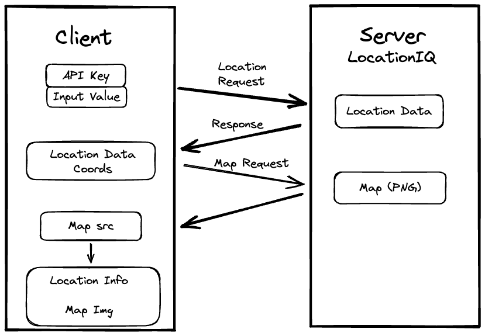

# Project Name

**Author**: Your Name Goes Here
**Version**: 1.0.0 (increment the patch/fix version number if you make more commits past your first submission)

## Overview
This application is our intro to servers, the web request response cycle, and APIs.  We will be building a React application that uses the Axios library to make user-initiated requests for data from a third-party API. W will use the LocationIQ GeoLocating API.
<!-- Provide a high level overview of what this application is and why you are building it, beyond the fact that it's an assignment for this class. (i.e. What's your problem domain?) -->

## Getting Started

1. create-react-app
2. delete cruft
3. add form to App component to gather user input
4. get locationIQ API key and store in .env
5. request data from Location IQ API using the key and the seach input value
6. display data or error message based on the response from the server
7. use data to create source url for the map
8. display the map in an `` tag, with the aforementioned `src` attribute.

## Architecture

Technologies: React, Javascript, Axios, LocationIQ Geolocating API

<!-- Provide a detailed description of the application design. What technologies (languages, libraries, etc) you're using, and any other relevant design information. -->

## Change Log
09-26-2022 5:00 - Application now has basic styling and displays results data and a smap of the result location.
<!-- Use this area to document the iterative changes made to your application as each feature is successfully implemented. Use time stamps. Here's an example:

01-01-2001 4:59pm - Application now has a fully-functional express server, with a GET route for the location resource. -->

## Credit and Collaborations

Worked with Ian Forrester on displaying the data and map.
<!-- Give credit (and a link) to other people or resources that helped you build this application. -->